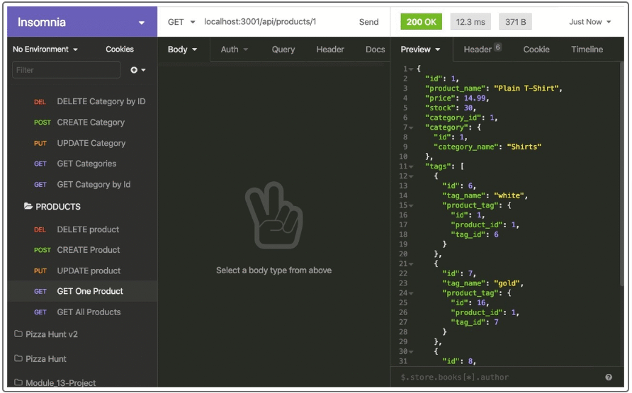

# Back-End-Ecommerce

## Resources 
[GitHubLink](https://github.com/FocusKing/Back-End-Ecommerce)
[Screencastify Demo](https://drive.google.com/file/d/1k5uO-_HW3zTzC7gauAKqcuitb9mfOh2a/view)

## Badges

## Description
GIVEN a functional Express.js API
WHEN I add my database name, MySQL username, and MySQL password to an environment variable file
THEN I am able to connect to a database using Sequelize
WHEN I enter schema and seed commands
THEN a development database is created and is seeded with test data
WHEN I enter the command to invoke the application
THEN my server is started and the Sequelize models are synced to the MySQL database
WHEN I open API GET routes in Insomnia Core for categories, products, or tags
THEN the data for each of these routes is displayed in a formatted JSON
WHEN I test API POST, PUT, and DELETE routes in Insomnia Core
THEN I am able to successfully create, update, and delete data in my database
## Table of Contents 

- [Installation](#installation)
- [Usage](#usage)
- [Visuals](#visuals)
- [Credits](#credits)
- [License](#license)
- [Test](#tests)

## Installation
In this challenge, there is code which builds out a e-commerce back-end database. The code builds out a template which is then used in the application Insomnia. 

## Usage
AS A manager at an internet retail company
I WANT a back end for my e-commerce website that uses the latest technologies
SO THAT my company can compete with other e-commerce companies  

## Credits
 I was fortunate enough to get additional assistance from class mates either during office hours or during private study group sessions after class. I truly appreciate any help that I have received throughout this project.

## License
MIT License

Copyright (c) [2022] [Marquise Allen]

## Tests
Great way to test the program is by running "mysql -u root" to get into the mysql dependency, then run "source db/schema.sql" and be sure to exit the program before you attempt to run the database. Also, be sure to check your package json file for any other dependecies or installations necessary to start your programs. The user will then run nodemon or npm start to initilize the application, to test and check your routes, use insomnia to see all of your request results. 